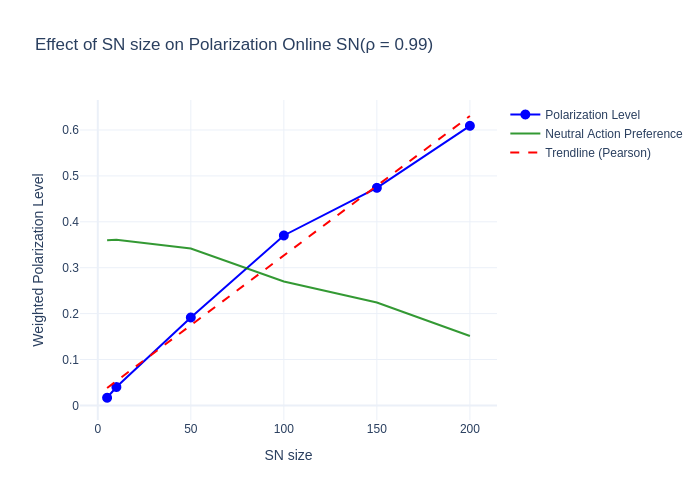

# Actor-Critic Reinforcement Learning for Social Network Behavior

**Actor-Critic** is a core Reinforcement Learning (RL) method that combines a policy model (“actor”) with a value function (“critic”). The actor selects actions, while the critic estimates their quality and guides updates. This balance of policy gradients and value-based feedback is particularly useful in multi-agent settings.

## Project Context
Developed as part of a **Computational Cognition Lab** project, this repository applies an Actor-Critic approach to study agent behavior in varied social networks—ranging from stable, offline groups to dynamic online communities. We focus on how **social feedback** (peer responses) influences consensus, polarization, and cooperation.

## Contents

- **`Interindividual_actor_critic_RL.py`**  
  - Core Python script implementing the multi-agent Actor-Critic logic and social feedback mechanisms.
- **`ACRL_TESTING.ipynb`**  
  - Notebook for additional tests and parameter tuning using the Actor-Critic approach.
- **`simulations.ipynb`**  
  - Main notebook running multi-agent RL experiments under various network conditions (e.g., link strength, network size).
  - Generates plots showing outcomes like consensus, polarization, and group behavior.
- **`Traditional vs Online Social networks.pdf`**  
  - Explains the theoretical basis, experiment design, and key findings.

## Example Result: Network Size and Polarization

*Figure 1: As the social network grows (x-axis), polarization (blue line) increases. The green line shows how neutral actions change, and the red dashed line is the correlation trend.*

## Example Result: Neutral Reward and Mean Action Preference

*Figure 2: Shows how applying a neutral reward influences the average action preference (blue line). The green line might represent alternative actions, and the red dashed line indicates correlation.*

For the **complete results and analysis**, please refer to the **final work** included in this repository.

